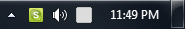
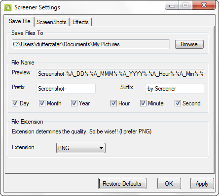
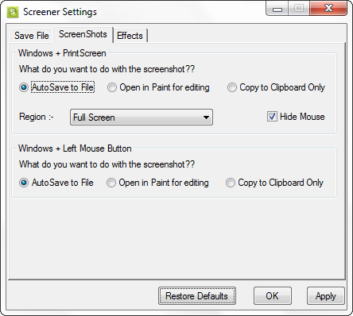
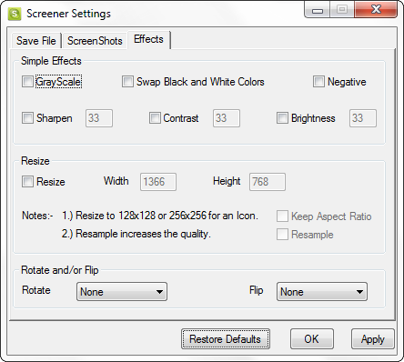

# Screener

A screen capturing script.

The original version used [Irfanview](www.irfanview.com) to grab and save screenshots, but I later found a far better method using GDI+ functions.

The only reason the initial script is still present is because it has a pretty nice GUI for changing settings and applying effects to the captured screenshot. The settings are stored in the registry and later re-loaded.

Without Irfanview the original version won't work.

## Screenshots

## Todo

* Merge the settings and other features with the new capture code.

* Play Audio on Capture

* Add Timer - 'Capture after 15 seconds.'
